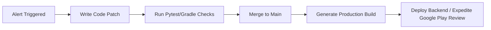

# Hotfix Runbook

This document details the emergency hotfix patch workflow, signed builds, and expedited mobile store review procedures.

---

## 1. Hotfix Workflow Overview


---

## 2. Emergency Backend Patching
1. **Create Hotfix Branch:**
   Branch off the main production tag:
   ```bash
   git checkout -b hotfix/remediate-critical-bug
   ```
2. **Implement and Test Fix:**
   Apply the code fix. Run pytest to ensure zero regressions:
   ```bash
   .\venv\Scripts\pytest
   ```
3. **Merge and Push:**
   Merge hotfix into `main` and trigger production CD pipeline.
4. **Staged Deployment:**
   Deploy to staging env first, run `/health` verification, then promote to production.

---

## 3. Android Application Emergency Hotfix
If a critical app crash occurs in production, execute an expedited hotfix release:
1. **Code Patch:**
   Apply the fix in the Android Kotlin codebase.
2. **Increment Build Version:**
   In [build.gradle.kts](file:///c:/Users/VikasVijigiri/Documents/SkoLab/android-app/app/build.gradle.kts#L19-L20), increment both `versionCode` and `versionName`:
   * Example: `versionCode = 3`, `versionName = "1.1.1-skolab"`
3. **Generate Signed Release APK:**
   Run Gradle build to generate the production release APK:
   ```bash
   .\gradlew.bat assembleRelease --no-daemon
   ```
4. **Expedited Play Store Review Request:**
   * Go to Google Play Console.
   * Upload the signed APK to the production track.
   * Submit the release for review.
   * Contact Google Play Support via the **Expedited Review Request form**, citing P0/P1 user impact and requesting emergency review approval.
