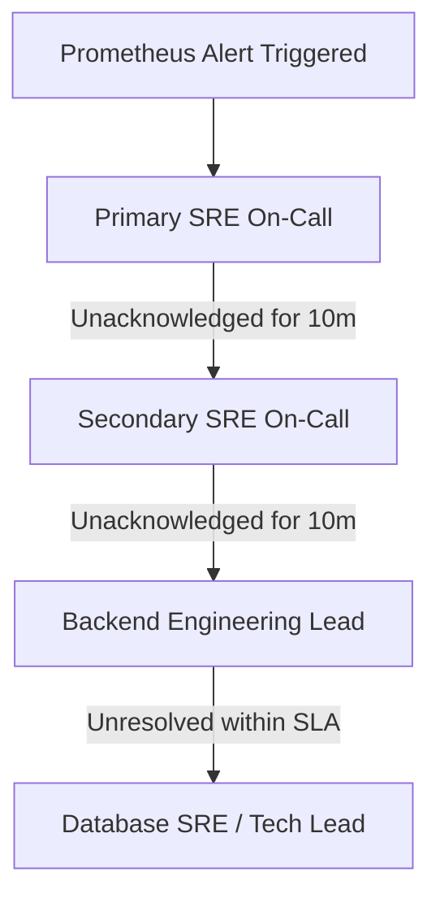

# Centralized Incident Response Runbook

This runbook establishes standard operational procedures for incident management, alert routing, database troubleshooting, route disabling via kill switches, and customer communications.

---

## 1. Incident Severity Definitions & SLAs (P0-P3)

| Severity | Definition | Target Resolution SLA | Escalation Trigger |
|---|---|---|---|
| **P0** | Total Service Outage (API down, Database unreachable) | **1 Hour** | Immediate pager (SMS/Call). Escalate to Secondary in 10m. |
| **P1** | Core Feature Outage (AI search, LLM recommendation, Agent chatbot down) | **4 Hours** | Immediate pager (SMS/Call). Escalate to Secondary in 10m. |
| **P2** | Degradation / Performance Outage (Response latency > 2 seconds) | **24 Hours** | Pager during working hours. Alert in Slack. Escalate in 30m. |
| **P3** | Trivial Outage / Minor Bugs (Cosmetic layout, minor documentation typo) | **7 Days** | Email notification / Slack ticket log. |

---

## 2. Escalation Matrix & Contacts

### Key Contacts
* **Database SRE Lead:** Database SRE Team (`db-sre@skolab.open` | `+1-555-0192`)
* **Backend Lead:** Backend Engineering Lead (`backend-lead@skolab.open` | `+1-555-0193`)
* **Security & Compliance Lead:** Security Team (`security@skolab.open` | `+1-555-0194`)

### Escalation Path


---

## 3. Pager Trigger Rules & Shift Handover

### Prometheus Alertmanager Trigger Rules
Configure alert rules in Prometheus to auto-trigger paging on these SRE metrics:
1. **API Availability:** `http_requests_total` error rate > 5% over 5m.
2. **API Latency:** `http_request_duration_seconds` p95 > 2s over 5m.
3. **Database Health:** Database connection errors/timeouts in logs > 3 occurrences in 1m.

### Shift Handover Log Template
When transitioning shifts, the outgoing SRE must log:
1. **Shift Time & Handover SREs:** Outgoing/Incoming SRE names.
2. **Pending Alert Tickets:** List of open Github issues or alerts active during shift.
3. **System Health Status:** Summary of average latencies and throughput.
4. **Maintenance Activities:** Deployments, hotfixes, or migrations executed.

### Incoming Engineer Pre-Shift Critical Alert Review

**MANDATORY: The incoming SRE must complete this checklist BEFORE assuming the shift.**

```
[ ] 1. Reviewed all CRITICAL alerts currently firing in Prometheus/Alertmanager.
[ ] 2. Read the outgoing SRE's handover log for this shift.
[ ] 3. Confirmed all Pending Alert Tickets have been handed over with context.
[ ] 4. Run pre-shift check script and confirmed [PASS] on all items:
        .\venv\Scripts\python scripts/pre_shift_check.py
[ ] 5. Completed test page trigger and received page on mobile device.
[ ] 6. Verified PagerDuty on-call schedule shows your name as primary.
[ ] 7. Signed into the Slack war room channel: #incident-war-room.
```

**Incoming SRE must sign and timestamp the handover log after completing this checklist.**

---

## 4. Incident Command & Bridge Logistics

### War Rooms
* **Slack Emergency Channel:** `#incident-war-room`
* **Video Bridge Link:** `https://meet.google.com/skolab-incident-bridge`

### Role Descriptions
* **Incident Commander (IC):** Drives the incident response call. Guides debug efforts, sets recovery strategy, manages communications, and delegates code edits (never edits code directly).
* **Tech Lead (Communications):** Coordinates public notifications, status updates, and handles communication pipelines.
* **On-Call SRE (Responder):** Investigates logs, runs queries, writes hotfixes, or triggers rollbacks.

---

## 5. Operational Runbooks & Troubleshooting

### A. Database Lockups & Long-Running Queries
If SRE logs warning alerts saying `Slow SQL Query detected` or users see connection timeouts:
1. **List Active Queries & Locks:**
   Run this query on PostgreSQL database to see what queries are holding locks:
   ```sql
   SELECT pid, age(clock_timestamp(), query_start), usename, query, state 
   FROM pg_stat_activity 
   WHERE state != 'idle' AND age(clock_timestamp(), query_start) > interval '10 seconds';
   ```
2. **Terminate Blocked Queries:**
   Find the PID from the list and terminate the query safely:
   ```sql
   SELECT pg_cancel_backend(PID);
   ```
   Or force terminate if unresponsive:
   ```sql
   SELECT pg_terminate_backend(PID);
   ```
3. **Check EXPLAIN Plans:**
   Verify slow queries using the explain plan from SRE warning logs to add missing indexes.

### B. Rate Limiting Rules Tuning
If users receive `HTTP 429 Too Many Requests` due to scraping or high load, SREs can adjust limits dynamically:
* In `.env`, modify `RATE_LIMIT_CAPACITY` and `RATE_LIMIT_REFILL_RATE` variables to allow higher throughput, then restart/reload the container.

### C. Active Route Kill Switches
To block resource-heavy routes (e.g. LLM searches or heavy integrations) during P0 load, configure the `KILL_SWITCHES` environment variable:
1. **Edit Environment Config:**
   Update the deployment container variables or edit `.env`:
   ```bash
   KILL_SWITCHES=collaborator/synergy,agent/chat
   ```
2. **Apply Kill Switch:**
   Restart/redeploy the backend service.
3. **Verification:**
   Verify that hitting the path returns:
   `HTTP 503 Service Unavailable: {"detail": "Feature 'collaborator/synergy' is temporarily disabled via SRE kill switch."}`

### D. Cache Clear Procedures

SkoLab uses a **PostgreSQL-backed cache** (`PgBackedCache`) for suggestions and profile data. If stale data is causing incorrect API responses, clear the cache tables as follows:

#### D1. Clear PostgreSQL-Backed Cache
1. **Identify stale cache tables:**
   ```sql
   SELECT table_name FROM information_schema.tables
   WHERE table_name LIKE '%cache%';
   ```
2. **Clear a specific cache table:**
   ```sql
   DELETE FROM suggestions_cache WHERE created_at < NOW() - INTERVAL '24 hours';
   DELETE FROM profile_cache WHERE created_at < NOW() - INTERVAL '24 hours';
   ```
3. **Full cache flush (P0 only — use with caution):**
   ```sql
   TRUNCATE TABLE suggestions_cache;
   TRUNCATE TABLE profile_cache;
   ```
4. **Verification:** Re-query the table and confirm row count is zero, then verify the API returns fresh data.

#### D2. Cache Clear via API Endpoint
If a cache invalidation endpoint is exposed (check `/docs` for `SRE` tagged routes):
```bash
curl -X DELETE https://api.skolab.open/v1/sre/cache \
  -H "X-Admin-Token: $ADMIN_SRE_TOKEN"
```

#### D3. Redis Cache Clear (if Redis is ever added to the stack)
If Redis is added as a caching layer in the future:
```bash
# Connect to Redis container
docker exec -it skolab_redis redis-cli

# Clear all keys in the default cache database
FLUSHDB

# Or selectively clear keys matching a pattern
SCAN 0 MATCH "suggestions:*" COUNT 100 | xargs redis-cli DEL
```

---

## 6. Customer Communication Pipelines

When P0/P1 outage strikes, Tech Leads must send customer updates on [SkoLab Status Page](https://status.skolab.open) using these templates:

### Outage Notification Template (Within 15 minutes of trigger)
> **Title:** Investigating System Unavailability
> **Status:** Investigating
> **Message:** We are currently investigating an issue causing system outages and failure responses on core API endpoints. Our SRE team is actively troubleshooting to restore services. Next update in 30 minutes.

### Resolution Notification Template
> **Title:** System Restored
> **Status:** Resolved
> **Message:** The issue causing service outages has been resolved. All API endpoints and backend databases are operating normally. We appreciate your patience while we restored the systems.

---

## 7. GDPR/CCPA Data Breach Notification Protocol

In the event of a security incident resulting in the unauthorized access, exposure, or alteration of Personally Identifiable Information (PII) (e.g., user email addresses or database records), SRE and Compliance teams must execute the following escalation matrix:

### A. Escalation Timeline & 72-Hour SLA
1. **Detection (T=0):** Security Lead identifies PII exposure. Immediately trigger a P0 incident.
2. **Assessment (T+12h):** Security Lead determines if the breach poses a risk to user rights and freedoms. If a risk exists, notifications are legally mandated.
3. **Regulatory Notification (T+48h):** Security and Compliance Leads must notify the supervisory Data Protection Authority (DPA) (e.g., European Data Protection Board or state Attorneys General) **within 72 hours** of detection.
4. **User Notification (T+60h):** If the breach poses a high risk to user security/privacy, Tech Lead must notify all affected users individually.

### B. Regulatory Notification Template
Tech Lead must dispatch this form to compliance authorities:
> **To:** [Supervisory Data Protection Authority]  
> **Subject:** Notification of Personal Data Breach — SkoLab  
>
> 1. **Nature of the Breach:** Briefly describe the incident, including categories of data and estimated number of data subjects.
> 2. **Data Protection Officer Contact:** [Security Lead Name] | `security@skolab.open`
> 3. **Likely Consequences:** Describe potential impact of the breach (e.g., identity theft, phishing risks).
> 4. **Remedial Measures Taken:** Detail immediate security patches applied, database connection updates, or revoked tokens.

### C. User Notification Template
 Tech Lead must dispatch this email to all affected users:
> **Subject:** Important Security Notice Regarding Your SkoLab Account  
>
> Dear Researcher,  
>
> We are writing to inform you of a recent security incident that may have affected some of your account credentials (email address).
>
> **What Happened:** On [Date], our security teams detected unauthorized access to a segment of our backend database. We immediately isolated the database and patched the vulnerability.
>
> **What Data Was Involved:** The data involved included registered researcher email addresses. No passwords or financial information were exposed (all local preferences/tokens are stored encrypted on-device).
>
> **What We Are Doing:** We have updated our network boundaries and security filters. We are actively working with compliance authorities and security partners.
>
> **What You Can Do:** As a precaution, we recommend remaining vigilant against unsolicited communications or phishing attempts.
>
> Sincerely,  
> SkoLab Security & Compliance Team
