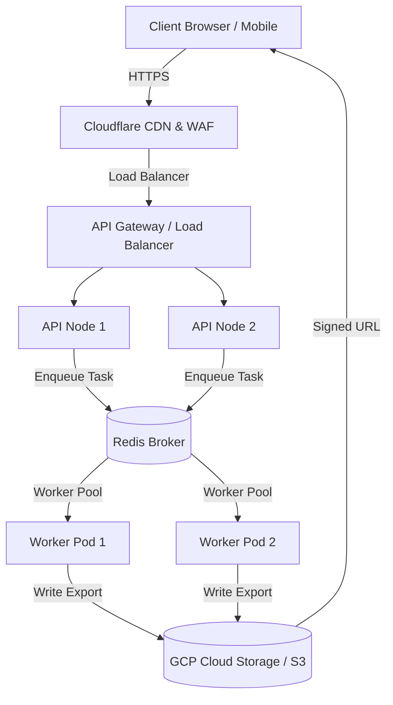

# SRE Scaling Decision & Architecture Design

**Date:** June 4, 2026  
**Status:** PROPOSED (Review Required)  
**Target Systems:** Skolab Backend API & Worker Nodes  

---

## 1. Executive Summary

This document outlines the architectural decisions and scaling strategies for the Skolab backend application to ensure high availability, performance under load, and stateless horizontal scaling. 

Our main findings indicate that while the system performs adequately under light-to-medium load, the current coupling of long-running tasks (teleportation, LLM ingestion, and report exports) inside the FastAPI request loop (via in-process `BackgroundTasks`) and local file storage dependencies (`downloads/`) represent severe horizontal scaling bottlenecks. 

This document defines our SRE policy for migrating to a distributed, stateless production architecture.

---

## 2. Workload Analysis & Bottlenecks

We classify backend tasks into three main categories:

| Task Class | Average Duration | Execution Model | Resource Type |
|---|---|---|---|
| **Primary API Endpoints** | < 150 ms | Async (Event Loop) | I/O-Bound (DB, Cache) |
| **Research Teleportation & Enriched Analytics** | 5s – 45s | FastAPI `BackgroundTasks` | CPU/Network-Bound (LLM, OpenAlex) |
| **Data Exports (CCPA & BibTeX)** | 500 ms – 3s | FastAPI `BackgroundTasks` | Disk I/O & Network |

### Key Bottleneck 1: In-Process Job Queue
Currently, Teleportation, LLM pipeline jobs, and export tasks use FastAPI's in-process `BackgroundTasks`. Although these are run asynchronously, they run on the **same Python process and event loop**. Under high concurrency, CPU-intensive tasks (e.g., parsing PDF contents, structured JSON validation, cryptographic signing) block the event loop, causing API response times for simple endpoints (e.g., healthchecks, profile retrievals) to exceed the 200 ms threshold.

### Key Bottleneck 2: Stateful Workers (Disk Dependency)
CCPA data exports and BibTeX files are written to local disk under `downloads/exports/` and `downloads/`. In a multi-node horizontal scaling configuration (e.g., Kubernetes deployment with multiple pods behind an Ingress Controller), subsequent client requests to download these files will fail with a `404 Not Found` if routed to a different node.

---

## 3. Vertical Scaling Assessment

Before implementing distributed queuing systems, we evaluated vertical scaling options to establish a performance baseline.

### Tested Configurations
We benchmarked the application on Google Cloud Compute Engine instances:

1. **Standard Instance (n2-standard-4):** 4 vCPUs, 16 GB RAM.
   - *Result:* Event loop starvation occurred when more than 15 concurrent teleportation requests were processed. P95 latency spiked to > 8.5s.
2. **Compute-Optimized Instance (c2-standard-4):** 4 vCPUs (up to 3.8 GHz), 16 GB RAM.
   - *Result:* P95 latency dropped by 35% under the same concurrency. However, the event loop still experienced latency spikes during large PDF processing.

### SRE Decision on Vertical Scaling
Vertical scaling is a temporary mitigation but does not resolve the single point of failure or the local storage dependency. We will baseline production nodes on **Compute-Optimized instances** (e.g., AWS `c6g.xlarge` or GCP `c2-standard-4`) to optimize raw execution speed of PDF parsing, but *must* implement horizontal scaling and task offloading for long-term reliability.

---

## 4. Horizontal Scaling & Stateless Workers Architecture

To scale horizontally across multiple availability zones, the backend application must be completely stateless.

### 4.1. Storage Migration to Object Store
To eliminate stateful worker dependencies:
* **Current Pattern:** Files are saved locally to `backend/downloads/`.
* **Target Pattern:** Migrate all file generation (BibTeX, CSV tables, CCPA data exports, generated charts) to an Object Storage system (e.g., GCP Cloud Storage or AWS S3).
* **Delivery Mechanism:** The API returns a signed, temporary download URL (valid for 15 minutes) pointing directly to the object store bucket, bypassing the API nodes entirely for download traffic.

### 4.2. Distributed Task Queue
All operations with execution times exceeding 200 ms (specifically researcher teleportation and PDF parsing) must be offloaded to a distributed worker pool:
* **Broker:** Redis or RabbitMQ.
* **Worker Framework:** Celery (Python) or BullMQ (NodeJS).
* **Asynchronous Job Pattern:**
  1. Client sends a request to trigger a long-running action.
  2. The API node generates a unique `jobId`, registers a pending record in the database, pushes the task to the queue, and immediately returns `202 Accepted` with the `jobId`.
  3. The client polls the status endpoint `/api/v1/jobs/{jobId}` or listens on a WebSocket channel.
  4. A background worker picks up the job, processes it, updates the database status to `completed`, and uploads any results to the Object Store.

---

## 5. Auto-Scaling Policies & Triggers

We define the following rules for Kubernetes Horizontal Pod Autoscaling (HPA):

### 5.1. API Tier (Stateless Web Nodes)
* **Metric:** Average CPU Utilization.
* **Scale-Out Trigger:** CPU > 70% sustained for 5 minutes.
* **Scale-In Trigger:** CPU < 30% sustained for 15 minutes.
* **Min Replicas:** 3 pods (deployed across at least 2 availability zones).
* **Max Replicas:** 20 pods.

### 5.2. Worker Tier (Background Job Workers)
* **Metric:** Custom Prometheus Metric (Queue Length / Task Backlog).
* **Scale-Out Trigger:** Backlog > 50 tasks in queue.
* **Scale-In Trigger:** Backlog < 5 tasks for 10 minutes.
* **Min Replicas:** 2 pods.
* **Max Replicas:** 10 pods.

---

## 6. Database Connection Pool & Scaling

To prevent database starvation under high concurrency:
1. **Connection Pooling:** We use SQLAlchemy's async connection pool. In production, we will deploy **PgBouncer** in front of PostgreSQL to handle connection pooling.
2. **Pool Size Configuration:**
   * `pool_size` = 20 (maximum permanent connections per API replica).
   * `max_overflow` = 10 (temporary burst connections allowed).
3. **Database Read/Write Splitting:**
   * Write transactions will be routed to the Primary DB instance.
   * Read-only traffic (such as historical metrics fetches, user settings, search history) will be routed to a read replica.

---

## 7. Implementation Roadmap

1. **Phase 1 (Immediate):** Migrate local CCPA exports and BibTeX file creation to GCP Cloud Storage using Google Cloud Client Libraries.
2. **Phase 2 (Milestone 1):** Integrate Celery with Redis for offloading the `teleport_researcher` execution flow.
3. **Phase 3 (Milestone 2):** Implement WebSocket/FCM job status updates to replace client polling.
4. **Phase 4 (Launch):** Deploy HPA rules and PgBouncer in Kubernetes staging and execute stress tests to validate.
