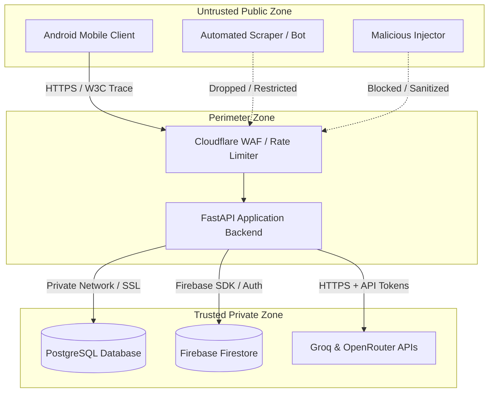

# Centralized Threat Model & Data Flow Document

This document maps all entry points, trust boundaries, data flows, malicious actor profiles, and corresponding mitigations for the SkoLab system.

---

## 1. System Architecture & Trust Boundaries

SkoLab operates across three distinct trust zones:
1. **Untrusted Public Zone:** Client mobile devices (Android) and public internet actors connecting to external domains.
2. **Perimeter Zone (FastAPI Backend API):** The public entry point for the SkoLab application, protected by WAF rules and rate limiters.
3. **Trusted Private Zone:** PostgreSQL databases, Firebase cloud document repositories, and SRE monitoring services.

---

## 2. Threat Actor Profiles & Malicious Scenarios

| Threat Actor | Motivation | Attack Vector | Mitigation |
|---|---|---|---|
| **Data Scraper** | Steal copyrighted/licensed academic data from OpenAlex. | High-frequency queries to search endpoints. | Path-specific rate limits + User-Agent blocking. |
| **Script Kiddie / Attacker** | Disrupt service / Access other user accounts. | Session spoofing, SQL injection, API abuse. | Device-specific HMAC signatures + Admin IP gating. |
| **Prompt Injector** | Hijack LLM credits / Extract system prompts. | Prompt stuffing in search/chat fields. | XML tagging isolation + Max character constraints. |
| **Direct DB Tamperer** | Modify database values (e.g., complete quests/get credits). | Modifying SQLite on device or executing SQL directly on compromised DB. | Record integrity HMAC-SHA256 signatures validated on read. |

---

## 3. Threat Mitigation Summary (STRIDE Map)

* **Spoofing:** Requests requesting writes validate `X-Device-Signature` calculated from the user's ID, timestamp, and a shared device secret.
* **Tampering:** Crucial quest state tables verify records against cryptographic HMAC-SHA256 signatures on database read operations.
* **Repudiation:** Telemetry logs record masked IDs, endpoints, and HTTP response codes within centralized W3C tracing spans.
* **Information Disclosure:** SRE / admin endpoints (`/metrics`, `/ai_status`) reject requests from public IPs or missing security tokens with `403 Forbidden`.
* **Denial of Service:** Path-specific token-bucket rate limits throttle automated scrapers on expensive search/auth resources to 5 requests/minute.
* **Elevation of Privilege:** Strict segregation between public and private Docker networks prevents direct external access to Postgres nodes on port 5432.
