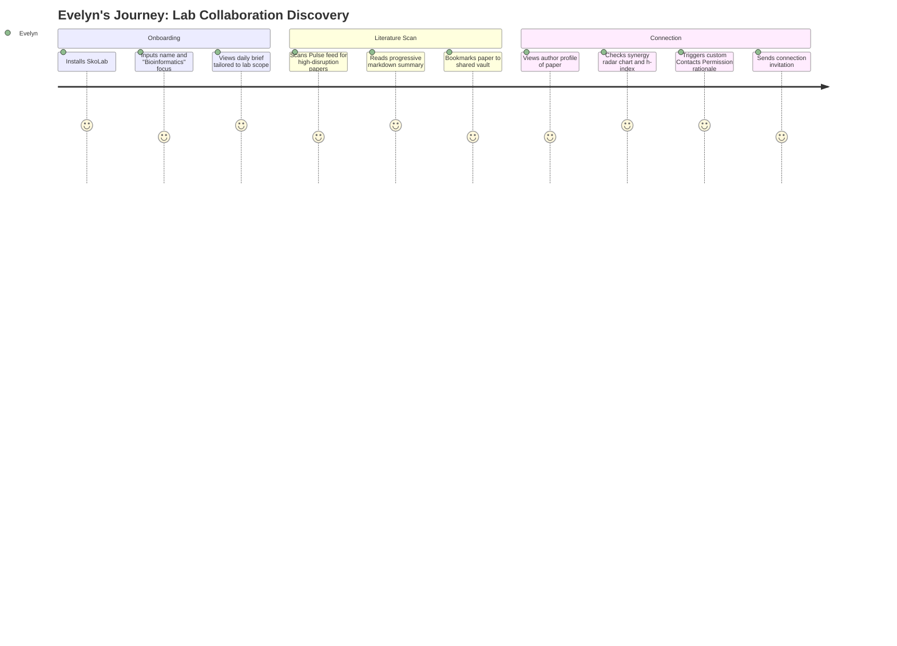

# User Personas & Journey Maps — SkoLab

This document outlines the core user personas and their corresponding user journey maps for the SkoLab academic intelligence platform. These definitions guide product design, feature prioritization, and engineering decisions.

---

## 1. User Personas

### Persona A: Dr. Evelyn Chen — The High-Impact Lab PI
* **Role**: Principal Investigator (Associate Professor of Bioinformatics)
* **Age**: 42
* **Institution**: Stanford School of Medicine
* **Core Needs**:
  - Filter out high-volume academic noise to find truly disruptive research.
  - Identify interdisciplinary collaborators for grant proposals.
  - Track metrics (Disruption Index, Novelty, and Citation Velocity) for tenure and department reviews.
* **Pain Points**:
  - Spends 4+ hours a week scanning abstracts on PubMed/arXiv, 90% of which are incremental.
  - Hard to assess a researcher's true impact beyond raw citation counts (which favor older, established authors).
  - Friction in onboarding new students to the lab's shared research repository.

---

### Persona B: Liam Thorne — The Time-Strapped PhD Student
* **Role**: 3rd Year PhD Candidate in Quantum Computing
* **Age**: 26
* **Institution**: Cambridge University
* **Core Needs**:
  - Quickly synthesize the methodology and key insights of newly published preprints.
  - Maintain a structured personal library (vault) of papers relevant to his thesis.
  - Understand complex formulas and LaTeX structures in mobile layouts.
* **Pain Points**:
  - Reading full PDFs on the go or on mobile is a terrible, panning-heavy experience.
  - Forgets where he read a specific insight or loses track of reading progress.
  - High cognitive load when trying to keep up with daily arXiv updates.

---

### Persona C: Marcus Vance — The Biotech R&D Director
* **Role**: Director of Applied Machine Learning & Drug Discovery
* **Age**: 49
* **Company**: Helix Therapeutics (Mid-sized Biotech Startup)
* **Core Needs**:
  - Discover patented methods and academic conjectures that can be licensed for commercial R&D.
  - Match academic findings directly to corporate funding grants and industry opportunities.
  - Direct communication lines with primary researchers to hire postdocs or license IP.
* **Pain Points**:
  - High friction in initiating contact with busy academic authors (cold emails ignored).
  - Academia-industry gaps: researchers don't understand commercial feasibility, and corporate teams can't verify academic reproducibility.
  - Lack of tools mapping academic papers directly to active corporate funding programs.

---

## 2. User Journey Maps

### Liam's Journey: Thesis Literature Review & Synthesis
1. **Discovery**: Liam opens the SkoLab app. On the `Daily Feed` tab of the `Intel Vault`, he is shown 3 personalized recommendations.
2. **Consumption**: He taps on the highest-match paper. Instead of a cramped PDF, he reads the progressively-rendered `MarkdownText` container (constrained to `560.dp` width for high readability).
3. **Retention & Scroll Sync**: He scrolls halfway through the paper on the train, then exits. When he re-opens the reader, the list position remembers his exact line offset, preventing him from losing his place.
4. **Action**: He bookmarks the paper to his "Saved" tab, causing a crisp tactile haptic feedback click confirming the write operation has succeeded.

### Marcus's Journey: Commercial Tech Transfer & Licensing
1. **Scouting**: Marcus opens the `Discovery` tab, typing "Protein Folding". The glass search bar triggers suggestions instantly.
2. **Analysis**: He selects a top researcher profile, evaluating their **Frontier Metrics** (Disruption Index vs average skill score) and **Citation Heatmap**.
3. **Licensing Opportunity**: He notices an active conjecture listed under the researcher's profile. Marcus taps "Synthesize Comparison Matrix" to compare this researcher's works against active Helix R&D projects.
4. **Action**: Marcus initiates a secure Chat Room session. The app requests Contacts permissions, displaying an explanatory rationale dialog before the system prompt. Marcus approves and drafts a collaborative proposal message.
